## 一、RobotSim基礎

## 手臂基本介紹
### 六軸機器手臂

### 軸向
- A1~A6 

### 空間
- Base空間

- Tool空間

 

### 線上模擬環境
- 我們把模擬環境放在網站上了
- 網址在這邊  [RobotSim WebPlayer](http://www.wtech.com.tw/robotsim)
- 在模擬器中我們可以學到這些
- 在模擬器中我們可以學到這些
	- 座標系
		- WORLD
		- BASE
		- TOOL    
	- 操作方式
		- XYZ ABC
		- AXIS
	- 運動指令
		- PTP
		- LIN
		- CIRC(網頁版的模擬器中沒有) 
	- 軸極限  
		- A1~A6
	- 手臂程式執行方式
		- 先教點
		- 用指令讓手臂重現動作 

## RobotSim環境及基本操作

### RobotSim 下載-安裝-試用
<iframe width="560" height="315" src="https://www.youtube.com/embed/KpkbhDKJbnQ" frameborder="0" allow="accelerometer; autoplay; encrypted-media; gyroscope; picture-in-picture" allowfullscreen></iframe>

- 影片參考 [連結](https://youtu.be/KpkbhDKJbnQ).

### RobotSim 教點-程式-模擬
<iframe width="560" height="315" src="https://www.youtube.com/embed/8uOQ80cGFXE" frameborder="0" allow="accelerometer; autoplay; encrypted-media; gyroscope; picture-in-picture" allowfullscreen></iframe>

- 影片參考 [連結](https://youtu.be/8uOQ80cGFXE).

### RobotSim 設定Tool-更新點位-模擬動作
<iframe width="560" height="315" src="https://www.youtube.com/embed/P47AQcqmRrg" frameborder="0" allow="accelerometer; autoplay; encrypted-media; gyroscope; picture-in-picture" allowfullscreen></iframe>

- 影片參考 [連結](https://youtu.be/P47AQcqmRrg).

### RobotSim 設定Base-設定手臂-匯出程式
<iframe width="560" height="315" src="https://www.youtube.com/embed/UuUzfkyk_WM" frameborder="0" allow="accelerometer; autoplay; encrypted-media; gyroscope; picture-in-picture" allowfullscreen></iframe>

- 影片參考 [連結](https://youtu.be/UuUzfkyk_WM).

## RobotSim程式設計
- 變數 Value
  - Bool、Int、Float、String
  - Set、Add、Sub、Mut、Div

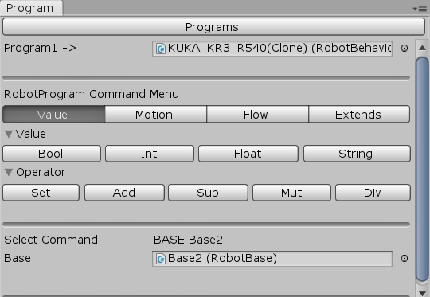 
- 動作 Motion
  - Base、Tool、Speed
  - PTP 、LIN、CIRC

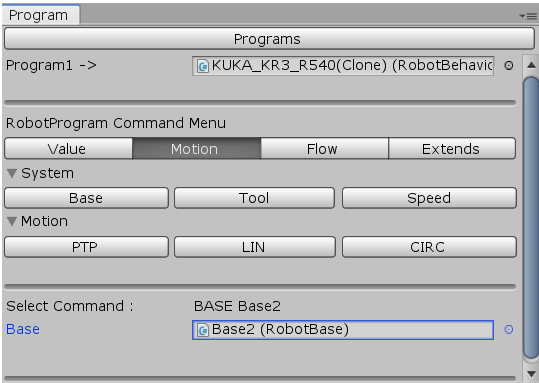 
- 流程控制 Flow
  - Loop、For-Loop、Wait Time
  - If-Else、While、Switch-Case

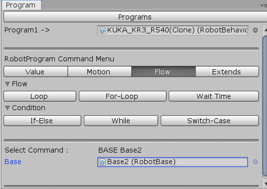

-功能擴充Extends
 

## 練習
RobotSim環境下載頁面[載點](http://www.wtech.com.tw/public/download/robotsim/RobotSim_0_1_7346.unitypackage)
- 開啟Robot視窗、Program視窗、Controller視窗
- 加入空場景

- 加入機器手臂 Robot

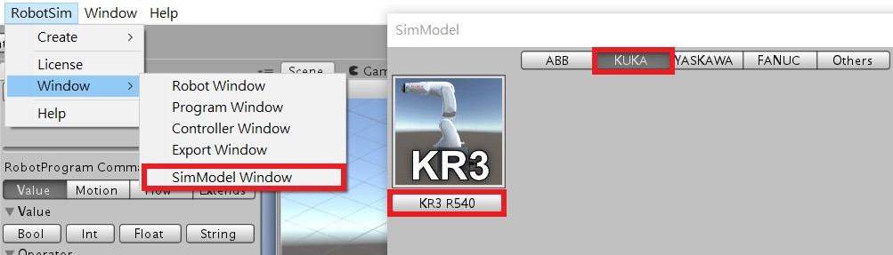
- 加入手臂程式 Program

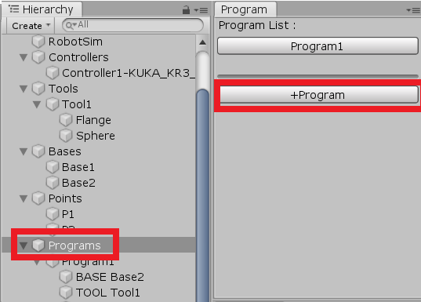
- 加入控制器 Controller

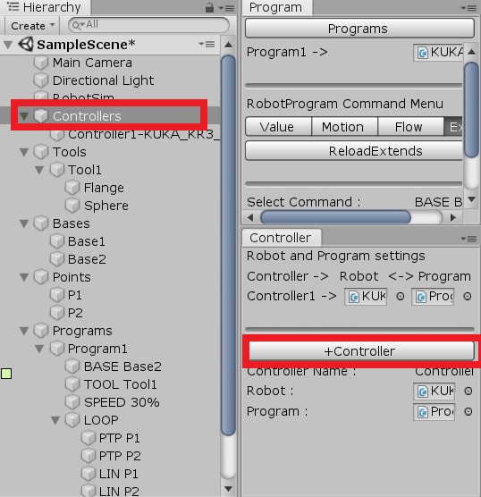
- 連結Robot、Controller、Program

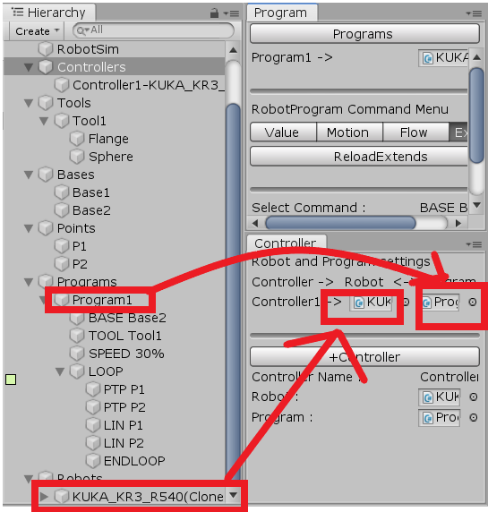
- 設定主攝影機視角

- 控制手臂加入點位1、點位2

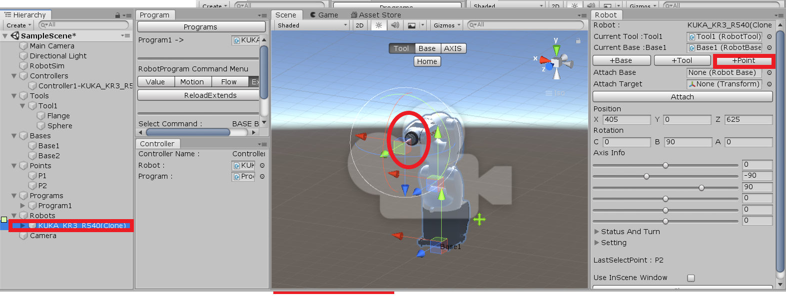
- 動作指令 PTP、LIN

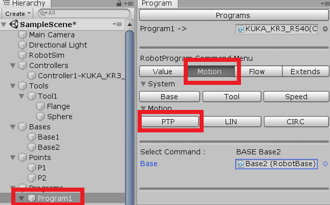
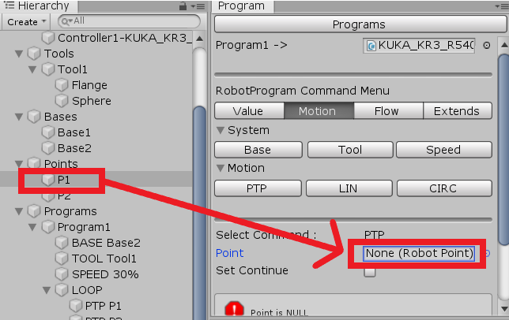
- 變數 INT I、流程控制 FOR-LOOP 迴圈

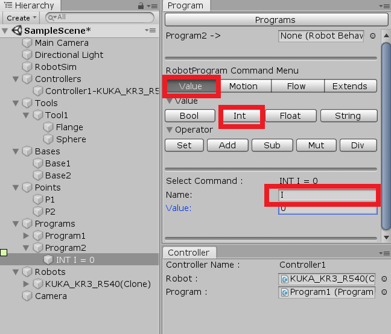
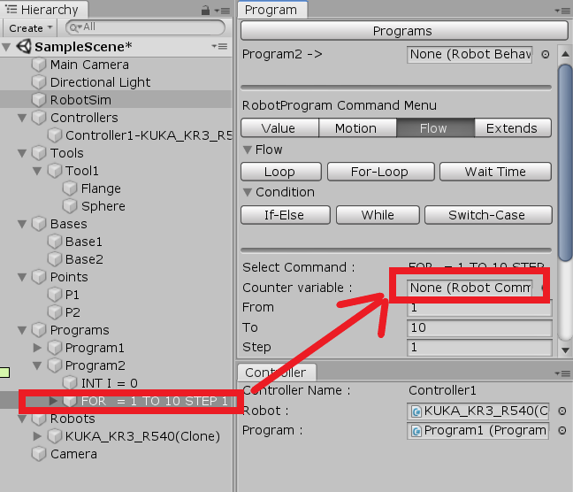
- 設定速度 SPEED、WAIT SEC 指令

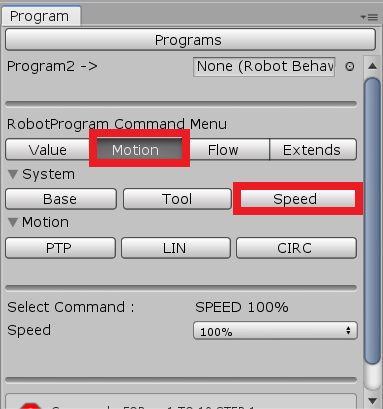
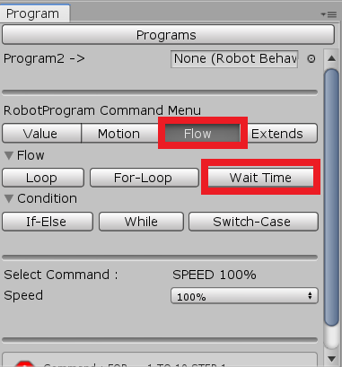

## 成果

<!--stackedit_data:
eyJoaXN0b3J5IjpbLTE2OTQ5MDg0NTcsMjA5MDE3NDc3OCwxMz
QwODI5Mjc1LC02MjYyNDg5MjksLTg3Mzk1NTI1NSwxNTI3NDU5
NDUwLC0xMTY1NDg1NDM2LDI1MTM5MDg4OCwxODE5MzY2ODk1LD
E3ODE5MTI0LDEwMzI1Nzk1MzksMTgwOTQ4Mzc3LC0xMzI4NTI2
NTk4LC0xNzc3MTk3Nzk0LC0xODgyMjY5NTUyLDg0MDA1ODk5LC
0xNTM1NDk1NjY1LC0yMDE5MzUzNTU0LC0xMzcxMTY1MDE4LDE5
Nzc3Njk0NTZdfQ==
-->